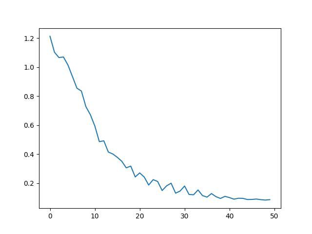

# Iris
The "Iris" dataset Originally published at UCI Machine Learning Repository: Iris Data Set, this small dataset from 1936 is often used for testing out machine learning algorithms and visualizations (for example, Scatter Plot). Each row of the table represents an iris flower, including its species and dimensions of its botanical parts, sepal and petal, in centimeters.

# What have been added by us
We're going to add a Dataset reader that you can seperate what percentages of it could be belong to Training and how much will remind to testing data.
Then we've applied a Simple Model for training them, plot the losses, print the accuracy percent and etc.

# Requirment
## Torch
```
pip install torch
```
## Pandas
```
pip install pandas
```
## Numpy
```
pip install numpy
```
## MathPlotLib
```
pip install matplotlib
```

# Plot Image

